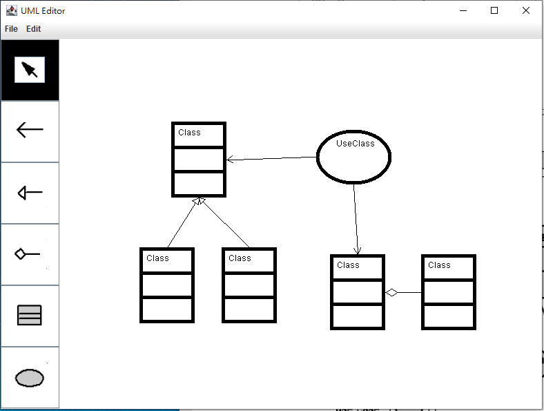
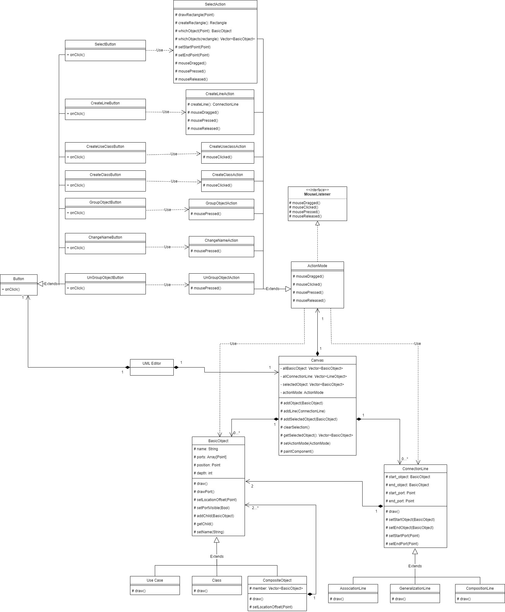

# UML Editor

## Screenshots

## About

此專案為中央資工所 **物件導向分析與設計(OOAD)** 課程之期末專案

## Feature

此為簡單的 UML editor，功能大致上如下:

- 基本物件 (Basic object)
  - Class
  - Use Case

- 連結物件 (Connection line)
  - Association Line
  - Composition Line
  - Generalization Line

- 操作行為 (Behavior)
  - Creating an UML object
  - Creating an UML connection line
  - Select/Unselect a single objects
  - Select/Unselect a group of objects
  - Group objects
  - UnGroup objects
  - Move objects
  - Change Object Name

更詳細的規格, [請參閱此檔案](./document/UML%20editor%20requirement%20-%20use%20case%20format.pdf)

## Class Diagram

## Abstract Methods
以下為每個 methods 的概略行為
- whichObject(Point) 鼠標落在哪個物件
- setStartPoint(Point) 設定鼠標起始點擊位置
- setEndPoint(Point) 設定鼠標結束點擊位置
- drawRectangle(Point) 繪製選取方框
- createRectangle() 創建選取框的矩形物件
- whichObjects(Rectangle) 取得在選取框裡的物件
- setActionMode(ActionMode) 設定畫布的滑鼠行為
- addObject(BasicObject) 把物件加入畫布
- removeObject(BasicObject) 把物件移除畫布
- addLine(LineObject) 把線加入畫布
- removeLine(LineObject) 把線移除畫布
- clearSelection() 清除所有選擇的物件
- addSelectedObject(BasicObject) 加入已選擇的物件清單
- getSelection() 取得已選取的物件
- setPortVisible(Bool) 設定port是否可見
- addChild(BasicObject) 加入物件至群組物件
- getChild() 取得群組物件內的子物件
- setLocationOffset(Point) 移動物件位置
- setName(String) 設定物件名稱
- setStartPort(Port) 設定線的起始點
- setEndPort(Port) 設定線的終點

## Use Cases in Abstract Sequence Diagram
UML editor 的每一個 use case 的 sequence diagram
- UseCase A.1 Creating an UML object

- UseCase B.1 Creating an UML connection line

- UseCase C.1 Select_Unselect a single objects

- UseCase C.2 Select_Unselect a group of objects

- UseCase D.1 Group objects

- UseCase D.2 UnGroup objects

- UseCase E.1 Move objects

- UseCase F.1 Change Object Name

